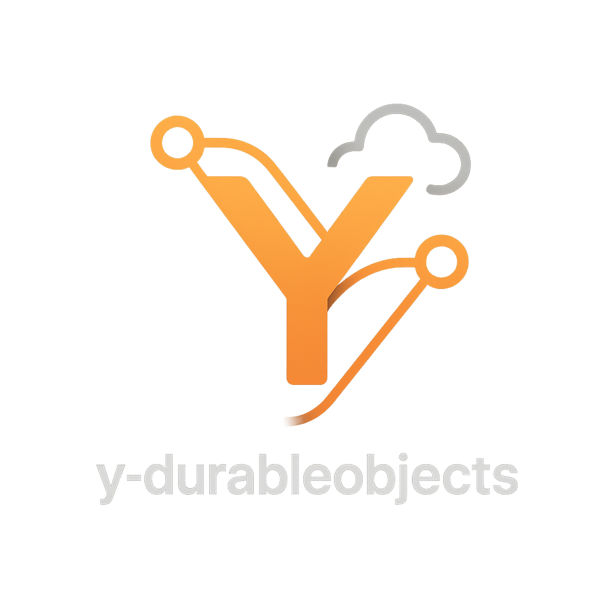

<div align="center">
  
</div>

# y-durableobjects

[](https://gyazo.com/e94637740dbb11fc5107b0cd0850326d)

The `y-durableobjects` library is designed to facilitate real-time collaboration in the Cloudflare Workers environment using Yjs and Durable Objects. It provides a straightforward way to integrate Yjs for decentralized, scalable real-time editing features.

## Requirements

- Hono version 4.3 or higher is required.

## Installation

To use `y-durableobjects`, you need to install the package along with `hono`, as it is a peer dependency.

```bash
npm install y-durableobjects hono
```

or using yarn:

```bash
yarn add y-durableobjects hono
```

or pnpm:

```bash
pnpm add y-durableobjects hono
```

### Configuration for Durable Objects

To properly utilize Durable Objects, you need to configure bindings in your `wrangler.toml` file. This involves specifying the name of the Durable Object binding and the class name that represents your Durable Object. For detailed instructions on how to set up your `wrangler.toml` for Durable Objects, including setting up environment variables and additional resources, refer to [Cloudflare's Durable Objects documentation](https://developers.cloudflare.com/durable-objects/get-started/#5-configure-durable-object-bindings).

This configuration ensures that your Cloudflare Worker can correctly instantiate and interact with Durable Objects, allowing `y-durableobjects` to manage real-time collaboration sessions.

```toml
name = "your-worker-name"
main = "src/index.ts"
compatibility_date = "2025-04-01"

account_id = "your-account-id"
workers_dev = true

# Durable Objects binding
[durable_objects]
bindings = [
  { name = "Y_DURABLE_OBJECTS", class_name = "YDurableObjects" }
]

# Durable Objects migrations
# v2 requires the SQLite storage backend.
[[migrations]]
tag = "v1"
new_sqlite_classes = ["YDurableObjects"]
```

## Migrating from v1 (key-value backend)

v2 requires the SQLite storage backend. A Durable Object namespace's storage
type is immutable, so an existing v1 namespace cannot be converted in place —
Cloudflare rejects it with `storage_type_mismatch`.

Run both versions side by side and copy each room across:

1. Keep your existing v1 binding (for example `Y_LEGACY`) pinned to
   `y-durableobjects@1`.
2. Add a new binding backed by v2 with `new_sqlite_classes`.
3. Copy each room over. `getYDoc()` returns a raw Yjs update and v2's
   `updateYDoc()` accepts one, so a single round trip is enough:

```typescript
app.post("/migrate/:id", async (c) => {
  const id = c.req.param("id");
  const legacy = c.env.Y_LEGACY.get(c.env.Y_LEGACY.idFromName(id));
  const next = c.env.Y_DURABLE_OBJECTS.get(
    c.env.Y_DURABLE_OBJECTS.idFromName(id),
  );

  await next.updateYDoc(await legacy.getYDoc());

  return c.json({ ok: true });
});
```

4. Once every room is copied, remove the v1 binding.

### Document size

Durable Objects give each instance 10GB of SQLite storage, but the whole
document must fit in the instance's 128MB of memory. That memory limit — not
storage — is the practical ceiling on document size.

### Keepalive and hibernation

v2 registers a `"ping"` / `"pong"` auto-response via
`setWebSocketAutoResponse`. When a client sends `"ping"` as a keepalive, the
Workers runtime answers with `"pong"` directly — the Durable Object is never
woken from hibernation to run `webSocketMessage`, because the auto-response
is matched before that handler would be invoked at all. This interception is
the entire point of the hibernation optimization, and it's the single biggest
lever on duration billing. As a secondary safety net, `webSocketMessage`
ignores non-binary (string) messages, so even if a `"ping"` ever did reach a
woken instance it would be a no-op.

## Usage

### With Hono shorthand

```typescript
import { Hono } from "hono";
import { YDurableObjects, yRoute } from "y-durableobjects";

type Bindings = {
  Y_DURABLE_OBJECTS: DurableObjectNamespace<YDurableObjects<Env>>;
};

type Env = {
  Bindings: Bindings;
};

const app = new Hono<Env>();

const route = app.route(
  "/editor",
  yRoute<Env>((env) => env.Y_DURABLE_OBJECTS),
);

export default route;
export type AppType = typeof route;
export { YDurableObjects };
```

### Without the shorthand

The following example demonstrates how to integrate Hono RPC with `y-durableobjects`. Note that WebSocket connections must be handled via fetch due to the current limitations of JS RPC (see [Cloudflare issue](https://github.com/cloudflare/workerd/issues/2319)):

```typescript
import { Hono } from "hono";
import { YDurableObjects, type YDurableObjectsAppType } from "y-durableobjects";
import { upgrade } from "y-durableobjects/helpers/upgrade";

type Bindings = {
  Y_DURABLE_OBJECTS: DurableObjectNamespace<YDurableObjects<Env>>;
};

type Env = {
  Bindings: Bindings;
};

const app = new Hono<Env>();
app.get("/editor/:id", upgrade(), async (c) => {
  const id = c.env.Y_DURABLE_OBJECTS.idFromName(c.req.param("id"));
  const stub = c.env.Y_DURABLE_OBJECTS.get(id);

  const url = new URL("/", c.req.url);
  const client = hc<YDurableObjectsAppType>(url.toString(), {
    fetch: stub.fetch.bind(stub),
  });

  const res = await client.rooms[":id"].$get(
    { param: { id: c.req.param("id") } },
    { init: { headers: c.req.raw.headers } },
  );

  return new Response(null, {
    webSocket: res.webSocket,
    status: res.status,
    statusText: res.statusText,
  });
});

export default app;
export type AppType = typeof app;
export { YDurableObjects };
```

### JS RPC support

`y-durableobjects` supports JS RPC for fetching and updating YDocs. Below are examples of how to use the `getYDoc` and `updateYDoc` interfaces.

#### getYDoc

This API fetches the state of the YDoc within a Durable Object.

Example usage in Hono:

```typescript
import { Hono } from "hono";
import { YDurableObjects } from "y-durableobjects";
import { fromUint8Array } from "js-base64";

type Bindings = {
  Y_DURABLE_OBJECTS: DurableObjectNamespace<YDurableObjects<Env>>;
};

type Env = {
  Bindings: Bindings;
};

const app = new Hono<Env>();

app.get("/rooms/:id/state", async (c) => {
  const roomId = c.req.param("id");
  const id = c.env.Y_DURABLE_OBJECTS.idFromName(roomId);
  const stub = c.env.Y_DURABLE_OBJECTS.get(id);

  const doc = await stub.getYDoc();
  const base64 = fromUint8Array(doc);

  return c.json({ doc: base64 }, 200);
});

export default app;
export { YDurableObjects };
```

#### updateYDoc

This API updates the state of the YDoc within a Durable Object.

`updateYDoc` takes a raw Yjs update — the same format `getYDoc` returns and
`Y.encodeStateAsUpdate(doc)` produces. It is not a sync-protocol message.

Example usage in Hono:

```typescript
import { Hono } from "hono";
import { YDurableObjects } from "y-durableobjects";

type Bindings = {
  Y_DURABLE_OBJECTS: DurableObjectNamespace<YDurableObjects<Env>>;
};

type Env = {
  Bindings: Bindings;
};

const app = new Hono<Env>();

app.post("/rooms/:id/update", async (c) => {
  const roomId = c.req.param("id");
  const id = c.env.Y_DURABLE_OBJECTS.idFromName(roomId);
  const stub = c.env.Y_DURABLE_OBJECTS.get(id);

  const buffer = await c.req.arrayBuffer();
  const update = new Uint8Array(buffer);

  await stub.updateYDoc(update);

  return c.json(null, 200);
});

export default app;
export { YDurableObjects };
```

### Extending with JS RPC

By supporting JS RPC, `y-durableobjects` allows for advanced operations through extensions. You can manipulate the protected fields for custom functionality:

Example:

```typescript
import { applyUpdate, encodeStateAsUpdate } from "yjs";
import { YDurableObjects } from "y-durableobjects";

export class CustomDurableObject extends YDurableObjects {
  async customMethod() {
    // Access and manipulate the YDoc state
    const update = new Uint8Array([
      /* some update data */
    ]);
    this.doc.update(update);
    await this.cleanup();
  }
}
```

### Hono RPC support for ClientSide

- Utilizes Hono's WebSocket Helper, making the `$ws` method available in `hono/client` for WebSocket communications.
  - For more information on server and client setup, see the [Hono WebSocket Helper documentation](https://hono.dev/helpers/websocket#server-and-client).

#### Server Implementation

##### Using shorthand

```typescript
import { Hono } from "hono";
import { YDurableObjects, yRoute } from "y-durableobjects";

type Bindings = {
  Y_DURABLE_OBJECTS: DurableObjectNamespace<YDurableObjects<Env>>;
};

type Env = {
  Bindings: Bindings;
};

const app = new Hono<Env>();
const route = app.route(
  "/editor",
  yRoute<Env>((env) => env.Y_DURABLE_OBJECTS),
);

export default route;
export type AppType = typeof route;
export { YDurableObjects };
```

##### Without shorthand

```typescript
import { Hono } from "hono";
import { YDurableObjects, YDurableObjectsAppType } from "y-durableobjects";
import { upgrade } from "y-durableobjects/helpers/upgrade";

type Bindings = {
  Y_DURABLE_OBJECTS: DurableObjectNamespace<YDurableObjects<Env>>;
};

type Env = {
  Bindings: Bindings;
};

const app = new Hono<Env>();
app.get("/editor/:id", upgrade(), async (c) => {
  const id = c.env.Y_DURABLE_OBJECTS.idFromName(c.req.param("id"));
  const stub = c.env.Y_DURABLE_OBJECTS.get(id);

  const url = new URL("/", c.req.url);
  const client = hc<YDurableObjectsAppType>(url, {
    fetch: stub.fetch.bind(stub),
  });

  const res = await client.rooms[":id"].$get(
    { param: { id: c.req.param("id") } },
    { init: { headers: c.req.raw.headers } },
  );

  return new Response(null, {
    webSocket: res.webSocket,
    status: res.status,
    statusText: res.statusText,
  });
});

export default app;
export type AppType = typeof app;
export { YDurableObjects };
```

#### Client Implementation

To utilize Hono RPC on the client side, you can create a typed client using `hc` from `hono/client`:

```typescript
import { hc } from "hono/client";
import type { AppType } from "./server"; // Adjust the import path as needed

const API_URL = "http://localhost:8787";

export const client = hc<AppType>(API_URL);
const ws = client.editor[":id"].$ws({ param: { id: "example" } });
//    ^?const ws: WebSocket
```

## Troubleshooting

### Cloudflare Env Type Collision

If you encounter TypeScript errors related to `Cloudflare.Env` type being empty or undefined, this is likely due to a type collision issue.

#### Problem

The issue occurs because `y-durableobjects` requires `@cloudflare/workers-types` as a peer dependency, which can create an empty `Cloudflare.Env` interface in `node_modules`. This empty interface overwrites your project's custom environment types and causes the `worker-configuration.d.ts` file generated from `wrangler types` to be ignored.

#### Recommended Approach

Starting with Wrangler v3, the `wrangler types` command is the recommended approach for generating TypeScript types for Cloudflare Workers. This command generates types based on your project's configuration, compatibility date, and bindings, ensuring accurate and up-to-date type definitions.

To generate types for your project:

```bash
wrangler types
```

This will create a `worker-configuration.d.ts` file (or similar) with the proper type definitions for your Cloudflare Workers environment.

#### Solution

If `Cloudflare.Env` remains empty even after upgrading to the latest `y-durableobjects` version, follow these steps:

1. **Check for remaining dependencies:**

   ```bash
   pnpm why @cloudflare/workers-types
   ```

2. **Clean install dependencies:**

   ```bash
   # Delete lock files and node_modules
   rm -rf node_modules pnpm-lock.yaml
   # Reinstall dependencies
   pnpm install
   ```

3. **Verify the fix:**
   Run `pnpm why @cloudflare/workers-types` again. If it returns nothing, the issue is resolved.

This issue was addressed in [PR #62](https://github.com/napolab/y-durableobjects/pull/62), but residual `@cloudflare/workers-types` dependencies from `wrangler` may still remain in your lock file until you perform a clean install.
